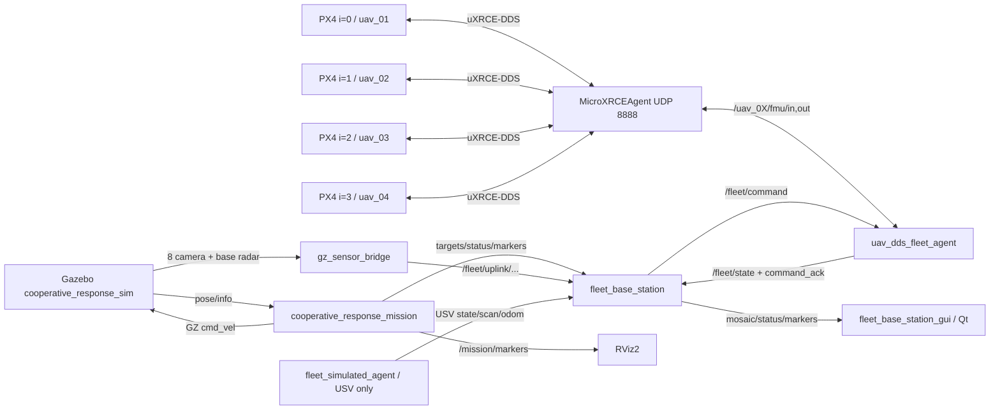
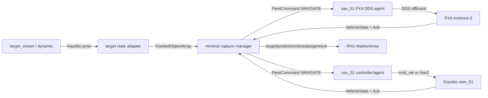

# UAV-USV 架构审计报告

审计日期：2026-07-13  
审计基线：`main` / `7a55843` 及当前工作区未提交集成改动  
目标 ROS 发行版：ROS 2 Humble  
Gazebo：Gazebo Sim 8.14.0  
PX4：本机 `/home/dji/PX4-Autopilot` 的当前 `main`

## 1. 审计结论

仓库已经具备动态目标、舰船控制、PX4/MAVLink 控制、ROS 2 FleetCommand
控制平面、Nav2、AIS/COLREGs、Qt 基站和 RViz Marker 等基础能力，但这些能力仍
存在两代实现并存：

1. `uav_usv_sim` 是早期可运行的单任务实现，任务节点常直接控制 Gazebo。
2. `uav_usv_*` 分包是新的模块化架构，使用 `FleetCommand`、`VehicleState`、
   `ControlLease` 和传感器上行话题。
3. `capture_mission.py` 已有围捕任务下发框架，但目标仍是固定灯塔，载具状态主要
   来自模拟代理；`start_px4` 只是占位开关。
4. `cooperative_response_mission.py` 已有移动敌船预测、动态围捕半径、槽位分配、
   巡逻、防守和避碰，但逻辑集中在一个大节点，并直接向 Gazebo 船体发送
   `cmd_vel`，尚未形成标准控制平面的完整闭环。
5. 四个 PX4 实例、四套 DDS namespace 和四路真实相机已实际上线；ROS 2 能以
   约 44-48 Hz 收到四路 `VehicleLocalPosition`。实际起飞测试被 PX4 健康检查
   拒绝，因此不能宣称多机飞行已通过。

## 2. 包与责任边界

| 包 | 当前责任 | 实际成熟度 |
|---|---|---|
| `uav_usv_interfaces` | 舰队命令、状态、控制权、目标、AIS、COLREGs 消息 | 已构建，接口可复用 |
| `uav_usv_description` | 机器人描述占位/迁移边界 | 基础 |
| `uav_usv_gazebo` | 新 Gazebo 世界、模型、插件资源 | 可运行，仍有场景重复 |
| `uav_usv_sim` | 原始仿真、PX4 启动、Nav2、灯塔协同、AIS/COLREGs | 功能最完整但耦合较高 |
| `uav_usv_uav_control` | MAVLink UAV 代理、实验性 PX4 DDS 舰队代理 | MAVLink 成熟；DDS 待飞行验收 |
| `uav_usv_usv_control` | FleetCommand 到 Nav2 目标的 USV 边缘代理 | 单艇接口已具备 |
| `uav_usv_navigation` | 新导航包边界 | 目前以 README/迁移边界为主 |
| `uav_usv_perception` | 统一感知输出边界 | 目前以接口约定为主 |
| `uav_usv_colregs` | DCPA/TCPA/COLREGs 边界 | 旧实现仍在 `uav_usv_sim` |
| `uav_usv_mission` | 基站、Qt、模拟代理、防守、围捕、协同响应 | 可运行但节点偏大、重复较多 |
| `uav_usv_bringup` | 集成 Launch、RViz、Qt 入口 | 多套入口并存 |
| `uav_usv_tests` | 预期系统测试和指标 | 当前没有可执行测试 |

## 3. 当前节点架构

以下为当前最新集成入口 `cooperative_response.launch.py` 的实际关系：



### 3.1 控制平面节点

| 节点 | 输入 | 输出 | 备注 |
|---|---|---|---|
| `fleet_base_station` | operator goal/action、state、ack、传感器 | lease、FleetCommand、SensorStatus、mosaic、marker | 当前最高层控制入口 |
| `uav_fleet_agent` | FleetCommand、ControlLease、MAVLink/GZ pose | VehicleState、CommandAck、camera uplink | 单机 MAVLink 实现 |
| `uav_dds_fleet_agent` | FleetCommand、PX4 DDS 状态 | PX4 DDS setpoint/command、VehicleState、Ack | 当前数量硬编码为 4 |
| `usv_fleet_agent` | FleetCommand、ControlLease、odom/sensors | Nav2 goal、VehicleState、Ack、sensor uplink | 默认实体仍硬编码 `simple_boat` 急停话题 |
| `boat_nav2_interface` | Nav2 `/cmd_vel`、LaserScan、GZ pose | GZ boat cmd、odom、TF、map、scan | MPPI/Nav2 与船体间适配层 |

### 3.2 任务与感知节点

| 节点 | 作用 | 当前限制 |
|---|---|---|
| `capture_mission` | 目标发布、固定围捕点生成、FleetCommand 下发 | 固定灯塔；多机多船；不是动态敌船估计 |
| `cooperative_response_mission` | 巡逻、防守、撤退目标、动态围捕、可视化 | 单大节点；直接控制 GZ；只读取第一架 PX4 |
| `defense_demo` | 多敌船入侵和动态防守点 | 与协同响应有明显重复 |
| `ais_simulator` | AIS contact、统一 track、marker | 主要用于 COLREGs 场景 |
| `gz_sensor_bridge` | Harmonic GZ Image/LaserScan 到 ROS 2 | 为解决 Humble `ros_gz_bridge` ABI 不匹配而增加 |
| `fleet_simulated_agent` | 模拟 VehicleState、图像、scan、odom | 不是物理载具控制器 |

## 4. ROS 2 接口审计

### 4.1 已有统一消息

| 消息 | 用途 | 对最小围捕是否足够 |
|---|---|---|
| `FleetCommand` | HOLD/NAVIGATE/TAKEOFF/PATROL/RETURN/LAND/急停 | 足够 |
| `CommandAck` | 接收、执行、成功、拒绝、失败、取消 | 足够 |
| `ControlLease` | 控制权、优先级、有效期、撤销 | 足够 |
| `VehicleState` | ID、类型、在线、解锁、模式、pose/twist、电量 | 足够 |
| `TrackedObject(Array)` | 多源目标、pose/twist、尺寸、置信度 | 足够 |
| `SensorStatus` | 上行 topic、频率、延迟、健康度 | 足够 |
| `AisContact(Array)` | AIS 原始/模拟输入 | 后续可选 |
| `CollisionRisk` / `ColregsDecision` | DCPA/TCPA 与避碰决策 | 后续可选 |

最小闭环不需要新增消息。任务阶段目前通过 `std_msgs/String` 发布，长期应改成
结构化任务状态，但第一阶段不改共享接口。

### 4.2 核心 topic

| Topic | 类型 | 生产者 -> 消费者 |
|---|---|---|
| `/fleet/control_lease` | `ControlLease` | base station -> edge agents |
| `/fleet/command` | `FleetCommand` | base station/mission -> UAV/USV agents |
| `/fleet/command_ack` | `CommandAck` | agents -> base station/mission |
| `/fleet/state` | `VehicleState` | agents -> base station/Qt/mission |
| `/fleet/perception/targets` | `TrackedObjectArray` | perception/mission -> base station/Qt |
| `/fleet/base/operator_goal` | `PoseStamped` | Qt/RViz -> base station |
| `/fleet/base/operator_action` | `String` | Qt -> mission/base station |
| `/fleet/base/selected_target` | `PoseStamped` | mission -> Qt/RViz |
| `/fleet/capture/status` | `String` | capture/cooperative mission -> Qt |
| `/fleet/uplink/<vehicle>/camera` | `Image` | bridge/agent -> base station |
| `/fleet/uplink/<vehicle>/scan` | `LaserScan` | agent -> base station |
| `/fleet/uplink/<vehicle>/odom` | `Odometry` | agent -> base station |
| `/fleet/sensor_status` | `SensorStatus` | base station -> Qt |
| `/fleet/base/camera_mosaic` | `Image` | base station -> Qt/RViz |
| `/mission/markers` | `MarkerArray` | mission -> RViz |

### 4.3 Service 和 Action

| 名称 | 类型 | 现状 |
|---|---|---|
| `/<defense_node>/set_parameters` | `rcl_interfaces/SetParameters` | Qt 动态调整防守参数 |
| `land_on_deck`（任务节点内参数化名称） | 自定义逻辑使用 ROS service | 旧灯塔协同降落 |
| `/navigate_to_pose` | `nav2_msgs/NavigateToPose` action | `nav_goal_marker_relay`/Nav2 使用 |

舰队控制当前使用 topic + ack，而不是 ROS Action。最小闭环沿用该接口。

## 5. Namespace、frame 和坐标约定

### 5.1 Namespace

PX4 DDS 采用：

```text
/uav_01/fmu/in/*    /uav_01/fmu/out/*
/uav_02/fmu/in/*    /uav_02/fmu/out/*
/uav_03/fmu/in/*    /uav_03/fmu/out/*
/uav_04/fmu/in/*    /uav_04/fmu/out/*
```

任务并存 Launch 还使用 `/capture/...` 和 `/defense/...` 前缀，但新旧脚本中仍有
绝对 topic，导致 namespace 需要 Launch remap 才能隔离。

### 5.2 Frame

| Frame | 约定 |
|---|---|
| `world` | Gazebo 世界坐标，ENU |
| `map` | ROS 全局任务坐标，当前通过静态 TF 与 `world` 重合 |
| `odom` | Nav2 局部里程计坐标 |
| `<vehicle>/base_link` | 各载具本体 |
| `<vehicle>/front_lidar` | 船载雷达 |
| `<vehicle>/camera` | 相机消息 frame |
| `base_radar` | 基地雷达 |

PX4 `VehicleLocalPosition` 和 `TrajectorySetpoint` 使用 NED。当前 DDS 代理采用：

```text
ROS/Gazebo world_x = home_x + PX4 local_y
ROS/Gazebo world_y = home_y + PX4 local_x
ROS/Gazebo world_z = home_z - PX4 local_z
```

即 ENU `(x,y,z)` 到 PX4 NED `(north,east,down)` 为 `(y,x,-z)`。该转换目前散落在
`uav_dds_fleet_agent.py`，尚未形成共享工具和单元测试。

## 6. PX4 实例与 Gazebo 实体映射

当前 `cooperative_response.launch.py` 的映射如下：

| UAV ID | PX4 instance | 预期 system ID | DDS namespace | Gazebo entity | 初始 ENU pose |
|---|---:|---:|---|---|---|
| `uav_01` | 0 | 1 | `/uav_01` | `x500_mono_cam_down_0` | `(-131,-234,6.2)` |
| `uav_02` | 1 | 2 | `/uav_02` | `x500_mono_cam_down_1` | `(-109,-234,6.2)` |
| `uav_03` | 2 | 3 | `/uav_03` | `x500_mono_cam_down_2` | `(-131,-216,6.2)` |
| `uav_04` | 3 | 4 | `/uav_04` | `x500_mono_cam_down_3` | `(-109,-216,6.2)` |

四个实例共用 `MicroXRCEAgent udp4 -p 8888`，通过不同 client key 和 DDS namespace
区分。运行日志显示 MAVLink UDP 本地端口为 18570-18573，Onboard 端口为
14580-14583。DDS 输出使用当前 PX4 的版本化 topic：

```text
/uav_0X/fmu/out/vehicle_local_position_v1
/uav_0X/fmu/out/vehicle_status_v4
```

输入仍使用：

```text
/uav_0X/fmu/in/offboard_control_mode
/uav_0X/fmu/in/trajectory_setpoint
/uav_0X/fmu/in/vehicle_command
```

## 7. Gazebo 模型结构

### 7.1 当前协同响应世界

`cooperative_response_sim.sdf` 包含：

* `ocean_plane` + `waves`；
* `command_base` 和基地雷达；
* `fleet_uav_platform`；
* 四架 PX4 动态实体及四个只用于放大显示的 `large_uav_shell`；
* `own_01..04` 四艘己方船；
* `enemy_01..04` 四艘敌方船；
* 六个导航浮标；
* `BoatWaveFollower` 和 `DroneDeckFollower` 插件。

船体通过 Gazebo VelocityControl 的 `/model/<name>/cmd_vel` 控制。无人机外观壳由
`DroneDeckFollower` 跟随真正 PX4 实体，视觉放大不改变 PX4 动力学和碰撞体。

### 7.2 可复用的最小目标

`uav_usv_gazebo/models/target_vessel/model.sdf` 已经具备：

* 真实 collision/visual；
* VelocityControl；
* 初始线速度和角速度；
* 20 Hz pose publisher；
* BoatWaveFollower。

因此最小动态围捕应直接复用 `target_vessel`，不再创建另一套敌船模型。

## 8. 无人船控制审计

仓库中有三类船体控制：

1. 任务节点直接发布 Gazebo `cmd_vel`：防守和协同响应使用，响应直接但耦合高。
2. `boat_nav2_interface`：接收 Nav2 `/cmd_vel`，转换为 Gazebo 命令，同时提供
   map/odom/TF/LaserScan，适合正式导航。
3. `usv_fleet_agent`：校验控制权和命令有效期，把 FleetCommand NAVIGATE 转成
   Nav2 goal，并发布状态与 Ack。

正式链路应为：

```text
mission -> FleetCommand -> usv_fleet_agent -> Nav2 goal
        -> Nav2 controller -> /cmd_vel -> boat_nav2_interface -> Gazebo
```

最小闭环可先使用一个轻量目标跟踪控制器，但必须继续通过 FleetCommand/State/Ack
对外，不能把直接 Gazebo 控制伪装成完整舰队接口。

## 9. Qt 基站结构

`fleet_base_station_gui.py` 当前同时包含：

* `BaseStationGuiNode`：ROS 2 pub/sub 和参数 service client；
* `GuiSignals`：ROS 到 Qt 的跨线程信号；
* `VideoMosaicLabel`：相机拼图；
* `RadarWidget`：LaserScan 极坐标显示；
* `DefenseMapWidget`：二维态势；
* `BaseStationWindow`：总览、任务 Tab、表格、按钮和样式；
* 后台 `MultiThreadedExecutor` + Python thread；
* Qt 主线程的 QTimer 负责图像和参数刷新。

优点是 ROS spin 已脱离 UI 主线程。问题是 ROS、业务状态、绘图和完整窗口仍集中在
同一个约 1500 行脚本中，且 capture/defense namespace 依靠运行参数拼接，后续重构
应保持 signal 边界而拆分模型和面板。

## 10. 历史实现搜索结果

已搜索关键词：`pursuit`、`encircle`、`surround`、`formation`、`target`、`enemy`、
`tracking`、`interception`、`AIS`、`COLREG`、`patrol`、`mission`。

| 能力 | 已有实现 | 结论 |
|---|---|---|
| 动态敌船 | `target_vessel`、`defense_demo.py`、`cooperative_response_mission.py` | 复用 |
| 动态围捕 | `cooperative_response_mission.py::_update_capture` | 修复/拆分，不另起算法体系 |
| 固定目标围捕下发 | `capture_mission.py` | 改为动态 track 输入 |
| 防守点 | `defense_demo.py::_guard_point_for_enemy` | 保留 defense，不混入最小围捕 |
| 巡逻 | `defense_demo.py`、`cooperative_response_mission.py`、`uav_buoy_visual_mission.py` | 后续复用 |
| AIS | `ais_simulator.py` + AisContact 消息 | 第一阶段不依赖 |
| COLREGs | `colregs_scenario_controller.py`、Nav2 参数、CollisionRisk/Decision | 第一阶段不依赖 |
| Nav2 | `boat_nav2_interface.py` + MPPI 参数 | 最小闭环后接入 |
| 历史提交 | `8563493`/`2b4ea22` maritime defense demo；`08eba4d` pursuit world | 已检查，不重新创建 defense |

## 11. 实际基线测试

### 11.1 全仓构建

```bash
source /opt/ros/humble/setup.bash
source /home/dji/Desktop/Px4_ros/install/setup.bash
colcon build --symlink-install
```

结果：13 个包构建成功。

### 11.2 自动测试

```bash
colcon test --return-code-on-test-failure
colcon test-result --verbose
```

结果：命令成功，但报告为 `0 tests`。这不是“测试通过”，而是当前仓库缺少已注册的
自动测试。

### 11.3 最新协同响应运行

```bash
ros2 launch uav_usv_bringup cooperative_response.launch.py
```

已验证：

* 单一 Gazebo 世界启动；
* 四个 PX4 实例连接同一 XRCE Agent；
* 四路 DDS local position 约 44-48 Hz；
* 四路 PX4 相机约 8-10 Hz；
* 四路 USV 相机约 13-18 Hz；
* 四路 USV scan/导航约 10 Hz；
* 基地雷达约 4 Hz；
* `/fleet/state` 同时出现四艘 USV 和四架 UAV。

未通过：

* 对四架 UAV 发布 TAKEOFF 后，PX4 返回 `Arming denied: Resolve system health
  failures first`，四架保持 disarmed；
* 当前不能将“所有 UAV 可起飞”标记为完成。

## 12. 主要问题与风险

按优先级排序：

1. **PX4 起飞阻断**：DDS 指令被代理接受，但 PX4 预飞健康检查拒绝解锁。
2. **捕获闭环不完整**：固定目标 capture 与动态 cooperative response 是两套链路。
3. **控制边界混用**：任务节点直接控制 Gazebo，绕过 FleetCommand/Nav2 代理。
4. **硬编码**：UAV 数量、home、PX4 路径、DDS setup 路径和实例映射写在代码/Launch。
5. **命名空间不彻底**：绝对 topic 需要大量 remap，双世界时容易冲突。
6. **无自动测试**：全仓 `colcon test` 注册测试数为 0。
7. **ROS/GZ ABI**：Humble 的 apt `ros_gz_bridge` 使用旧 Ignition ABI，不能直接桥接
   Gazebo Harmonic；当前自定义桥只覆盖协同场景所需传感器。
8. **退出不干净**：部分新 Python 节点 Ctrl+C 时重复 `rclpy.shutdown()`，产生 RCLError。
9. **消息版本耦合**：本机 `px4_msgs` 必须与当前 PX4 源码同步；本次已从 PX4 的
   `msg/versioned` 同步，旧版本曾产生 87/88 字节 RTPS payload 错误。
10. **绝对路径**：新 Launch 中仍存在 `/home/dji/...`，不满足干净机器复现标准。

## 13. 第一阶段兼容边界

后续最小闭环应遵守：

1. 不新增共享消息，复用 `TrackedObjectArray`、`FleetCommand`、`VehicleState`、
   `CommandAck` 和 `ControlLease`。
2. 只使用 `uav_01`、`usv_01` 和 `target_vessel`。
3. ROS/Gazebo 全局位置统一为 `map/world` ENU；PX4 边界显式转换 NED。
4. 围捕任务管理不直接伪造 PX4 状态。
5. 动态目标状态必须来自 Gazebo pose/速度观测并发布为 `TrackedObjectArray`。
6. 围捕点随预测目标更新；一机负责空中观测/跟随，一船负责水面截获。
7. 第一阶段只证明真实链路，不提前引入多机重分配、Qt 重构或新大型框架。

## 14. 建议的最小闭环图（尚未实现）



此图是下一阶段的集成目标，不属于本报告的已实现内容。

