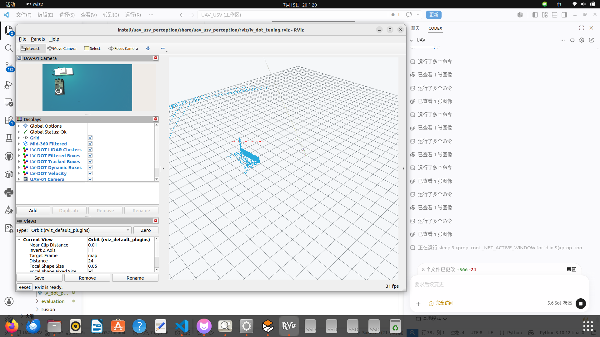
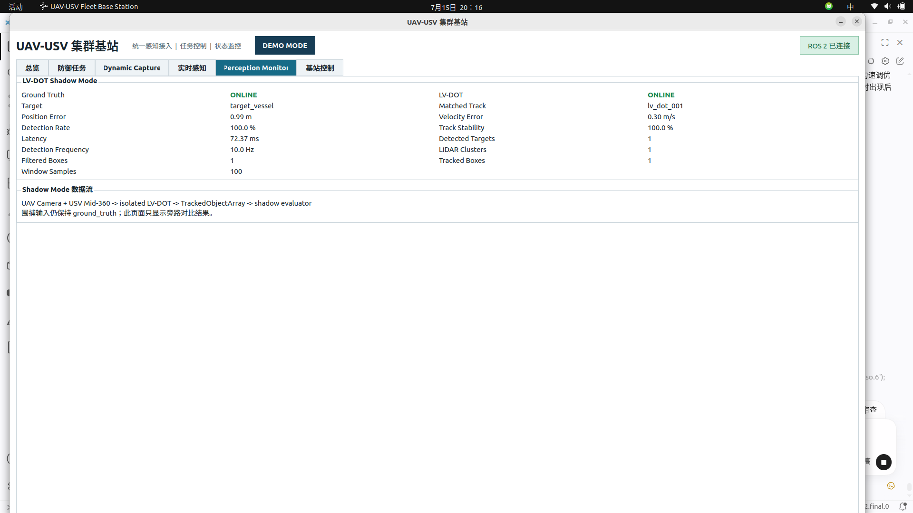

# LV-DOT 动态目标调优报告

## 1. 安全边界

本阶段只运行 Shadow Mode。`capture_manager` 仍从
`/fleet/perception/targets` 获取目标，`perception_source_mux` 默认并强制使用
`ground_truth`。LV-DOT 输出只进入：

```text
/perception/lv_dot/observations
/perception/lv_dot/shadow_metrics
```

没有修改 `FleetCommand`、PX4、Nav2、UAV/USV agent 或围捕状态机，也没有
把真实感知结果自动切换为控制输入。

## 2. 已定位的问题

### 2.1 原生处理范围较小

审计的 LV-DOT commit 为 `449bf2c960a26b067b235d82f6e0aac65fc05a6b`。
其 `dynamicDetector.h` 将 LiDAR 局部范围固定为：

```text
x: [-10 m, 10 m]
y: [-10 m, 10 m]
z: local processing range
```

因此测试目标必须留在 USV 周围约 10 m 的窗口内。调优世界中的匀速目标改为
每 12 s 反向一次，转弯和加速目标沿半径 2 m 的圆周运动，确保整个目标船
始终留在原生局部窗口内。

### 2.2 海浪点会干扰聚类

旧配置只做距离和船体自身裁剪。海面回波数量远大于目标船回波，会让聚类阶段
输出大面积海浪簇，或者让稀疏的目标点达不到 DBSCAN 最小点数。

本阶段给 `mid360_preprocessor` 增加通用的传感器坐标系高度裁剪参数：

```text
min_z
max_z
```

默认值保持宽范围，不改变主线。仅调优场景使用 `-1.75 m <= z <= 4.0 m`，
滤除低于目标船体的海面点，同时保留船体上缘、舱室和桅杆。
调优场景的体素尺寸使用 0.04 m，以避免再次稀释本就较少的远端船体回波；
主线 Mid-360 的默认体素参数不变。

### 2.3 动态判定需要连续通过三道门槛

LV-DOT 不是“检测到一个框就认为它在运动”。原生顺序为：

1. LiDAR DBSCAN 产生 `lidar_bboxes`；
2. 数据关联与 Kalman 滤波产生 `tracked_bboxes` 和速度；
3. 点云运动投票与 Kalman 速度同时超过阈值；
4. 连续若干帧满足条件后才进入 `dynamic_bboxes`。

基线真实场景曾观察到约 2710 个过滤后输入点、LiDAR 框为 0、跟踪框偶尔为 1、
动态框为 0。此前的合成输入已经证明 LiDAR 聚类可运行，但 Kalman 速度保持为 0，
所以最终动态框为空。

## 3. 参数调整

调优只修改隔离容器挂载的 `detector_param.yaml`，没有修改 LV-DOT 源码。

| 参数 | 调整前 | 调整后 | 作用 |
| --- | ---: | ---: | --- |
| `ground_height` | -1.0 m | 0.22 m | 去掉地图坐标系中的海面低点 |
| `roof_height` | 12.0 m | 6.0 m | 保留船体上层结构并减少高处杂点 |
| `voxel_occupied_thresh` | 3 | 2 | 保留稀疏目标体素 |
| `dbscan_min_points_cluster` | 8 | 6 | 放宽融合聚类初始化 |
| `dbscan_search_range_epsilon` | 0.35 m | 0.45 m | 连通相邻目标点 |
| `lidar_DBSCAN_min_points` | 8 | 3 | 允许稀疏 Mid-360 回波形成目标簇 |
| `lidar_DBSCAN_epsilon` | 0.45 m | 0.65 m | 连通船体相邻回波 |
| `gaussian_downsample_rate` | 4 | 16 | 提高远端目标点保留概率；源码中该值实际是高斯 sigma |
| `max_match_range` | 4.0 m | 2.0 m | 减少相邻杂簇错误关联 |
| `kalman_filter_averaging_frames` | 10 | 3 | 缩短速度初始化时间 |
| `frame_skip` | 5 | 2 | 使用较短帧间隔进行运动投票 |
| `dynamic_velocity_threshold` | 0.2 m/s | 0.05 m/s | 低速船仍可进入动态候选 |
| `dynamic_voting_threshold` | 0.7 | 0.15 | 适应海上稀疏、不稳定点云 |
| `frames_force_dynamic` | 10 | 3 | 缩短强制动态确认等待 |
| `frames_force_dynamic_check_range` | 30 | 12 | 缩短动态历史检查窗口 |
| `dynamic_consistency_threshold` | 10 帧 | 2 帧 | 缩短首次动态确认时间 |

这些参数只适合当前 Gazebo Shadow 调优场景，不能直接视为实船参数。

## 4. 可观察诊断链

隔离桥额外只读转发三个原生 MarkerArray：

| ROS 2 topic | 含义 |
| --- | --- |
| `/lv_dot/diagnostics/lidar_bboxes` | 原始 LiDAR 聚类框 |
| `/lv_dot/diagnostics/filtered_bboxes` | 过滤/融合后的检测框 |
| `/lv_dot/diagnostics/tracked_bboxes` | Kalman 跟踪框 |
| `/lv_dot/onboard_detector/dynamic_bboxes` | 最终动态框 |

`lv_dot_shadow_evaluator` 将各级框数量加入
`/perception/lv_dot/shadow_metrics`。Qt 的 Perception Monitor 页面显示：

- LiDAR Clusters；
- Filtered Boxes；
- Tracked Boxes；
- Detected Targets；
- Detection Frequency；
- 检测率、位置误差、速度误差、ID 切换、延迟。

因此可以直接判断失败发生在聚类、跟踪还是动态分类阶段。

## 5. 数据采集

启动最小场景：

```bash
source /opt/ros/humble/setup.bash
source install/setup.bash
ros2 launch uav_usv_perception lv_dot_tuning.launch.py \
  target_profile:=constant start_rviz:=true
```

第二个终端启动隔离后端：

```bash
tools/lv_dot/run_isolated.sh
```

第三个终端录包：

```bash
tools/lv_dot/record_tuning_bag.sh \
  bags/lv_dot_constant_$(date +%Y%m%d_%H%M%S)
```

不传输出路径时默认写入 `/tmp/uav_usv_bags`，避免高频图像和点云录包占满
`/home`。需要长期保存时再显式指定仓库外的数据盘目录。

将 `target_profile` 分别改成：

```text
constant
turn
acceleration
```

录包内容包括 UAV 图像与 CameraInfo、UAV/USV 位姿、Mid-360 原始和过滤点云、
目标真值、LV-DOT 各级框、最终观测、Shadow 指标、TF 和目标运动状态。

离线复测推荐直接使用自动化脚本。它为每次回放建立独立进程组，只回放输入，
并在结束后验证性地清理 ROS 2 节点、ROS 1 容器和 TCP 端口：

```bash
tools/lv_dot/run_replay_validation.sh \
  bags/<input_bag> bags/<recomputed_output_bag> 1.0

tools/lv_dot/analyze_tuning_bag.py \
  bags/<recomputed_output_bag> \
  --json-output bags/<recomputed_output_bag>/analysis.json
```

回放脚本不会重放旧的 LV-DOT 框和旧指标，因此每次结果都来自当前挂载的参数。
离线回放保留原传感器时间戳，适合比较检测率、位置/速度误差和 ID 稳定性；端到端
实时延迟应以在线运行结果为准。

## 6. 验证命令

```bash
ros2 param get /perception_source_mux perception_source
ros2 topic hz /perception/usv_01/points_filtered
ros2 topic hz /fleet/uplink/uav_01/camera/image_raw
ros2 topic echo /perception/lv_dot/shadow_metrics
ros2 topic echo /perception/lv_dot/observations --once
ros2 bag info bags/<bag_name>
```

安全检查的期望结果始终是：

```text
perception_source = ground_truth
```

## 7. 实测环境

测试日期为 2026-07-15，使用 Ubuntu 22.04.5、ROS 2 Humble、Gazebo Harmonic、
AMD Ryzen 7 8745H、14 GiB 内存和 NVIDIA RTX 4060 Laptop GPU 8 GiB。
LV-DOT 运行在 `uav-usv/lv-dot-noetic:449bf2c` 隔离容器中，宿主机静态 Docker
daemon 仅用于本次 ROS 1 Shadow 后端。

测试全程执行：

```bash
ros2 param get /perception_source_mux perception_source
```

实际结果始终为 `ground_truth`。没有将 LV-DOT 输出接入控制闭环。

## 8. 在线数据包

| 场景 | 本地数据包 | 时长 | 大小 | 消息数 | 图像/过滤点云频率 |
| --- | --- | ---: | ---: | ---: | ---: |
| 匀速 | `bags/lv_dot_acceptance/constant_final_20260715` | 106.87 s | 209 MiB | 33174 | 10.00/10.00 Hz |
| 转弯 | `bags/lv_dot_acceptance/turn_final_20260715` | 103.79 s | 202 MiB | 31977 | 10.00/10.00 Hz |
| 加速 | `bags/lv_dot_acceptance/acceleration_final_20260715` | 185.59 s | 364 MiB | 57681 | 10.00/10.00 Hz |

三份包均正常生成 `metadata.yaml`，节点在有效录制期间无崩溃。旧包中相机
`SensorStatus.dropped_messages` 为 848/792/1177，这是调优 launch 曾把期望频率
写成 15 Hz、而 SDF 实际发布 10 Hz 产生的“期望帧差额”，不是已证实的 DDS
丢包。launch 现已统一为 10 Hz；录包内图像和点云时间序列连续。

## 9. 在线量化结果

统计跳过最初 5 s 预热。位置和速度误差按最近真值关联并优先保持已有轨迹 ID。

| 场景 | 评估帧 | 检测率 | 最长丢失 | 位置均值/最大 | 速度均值/最大 | ID 切换 | 输出频率 |
| --- | ---: | ---: | ---: | ---: | ---: | ---: | ---: |
| 匀速 | 1009 | 100% | 0.00 s | 1.055/1.343 m | 0.196/1.214 m/s | 0 | 10.000 Hz |
| 转弯 | 973 | 100% | 0.00 s | 1.235/1.852 m | 0.413/2.833 m/s | 1 | 10.000 Hz |
| 加速 | 1803 | 100% | 0.00 s | 1.253/2.276 m | 0.431/2.223 m/s | 2 | 10.000 Hz |

| 场景 | LiDAR 框均值 | 过滤框均值 | 跟踪框均值 | 动态框均值 | 动态非空率 |
| --- | ---: | ---: | ---: | ---: | ---: |
| 匀速 | 1.312 | 1.314 | 1.314 | 1.239 | 100% |
| 转弯 | 1.505 | 1.505 | 1.505 | 1.346 | 100% |
| 加速 | 1.499 | 1.498 | 1.498 | 1.346 | 100% |

因此三条链路均明确通过：目标进入点云、LiDAR 聚类形成、跟踪建立、速度估计
非零、动态投票通过，最终 `dynamic_bboxes` 持续非空，adapter 持续发布
`TrackedObjectArray`。

## 10. 延迟与资源

ROS 2 egress 消息接收时间减目标更新时间的均值为 0.41--0.44 ms，表示最后一段
桥接/适配开销。Shadow evaluator 根据原始检测时间戳计算的端到端滚动延迟如下；
它包含隔离桥和检测，但由于 ROS 1/ROS 2 未做硬件时钟同步，只作为仿真工程指标。

| 场景 | Shadow 延迟均值/最高 | 宿主总 CPU 均值/最高 | 宿主 RSS 均值 | LV-DOT CPU 均值/最高 | LV-DOT 内存均值 |
| --- | ---: | ---: | ---: | ---: | ---: |
| 匀速 | 41.68/41.84 ms | 273.68/278.10% | 3575.96 MiB | 5.46/5.96% | 281.65 MiB |
| 转弯 | 3.05/6.49 ms | 267.96/272.40% | 3582.36 MiB | 5.83/6.23% | 173.18 MiB |
| 加速 | 26.66/26.95 ms | 265.24/265.40% | 3576.92 MiB | 5.42/5.62% | 179.55 MiB |

宿主 CPU 是 Gazebo、桥接、评估节点等匹配进程的多核百分比之和，因此可超过
100%。Qt 长时间运行截图中的窗口延迟约 72 ms，说明当前时间戳估计会随两个
运行环境的时钟偏差变化，未来 ROS 2 原生迁移应增加节点内部处理耗时诊断。

## 11. 离线重复性

每个在线包都以 1.0 倍速完整回放两次。回放脚本明确排除了旧 LV-DOT 输出，
每次都重新启动当前 detector、adapter 和 evaluator。

| 场景 | 回放 | 检测率 | 位置均值 | 速度均值 | ID 切换 | 动态非空率 | 输出频率 |
| --- | ---: | ---: | ---: | ---: | ---: | ---: | ---: |
| 匀速 | 1/2 | 100%/100% | 1.0546/1.0546 m | 0.1967/0.1968 m/s | 0/0 | 97.48/97.75% | 10.000/10.000 Hz |
| 转弯 | 1/2 | 100%/100% | 1.2346/1.2346 m | 0.4044/0.4073 m/s | 1/1 | 95.56/95.83% | 10.000/10.000 Hz |
| 加速 | 1/2 | 100%/100% | 1.2526/1.2527 m | 0.4275/0.4269 m/s | 2/2 | 98.21/98.26% | 10.000/10.017 Hz |

离线动态非空率包含容器连接前的空 Marker 帧；5 s 预热后的目标检测率均为
100%。两次回放的位置均值最大差 0.000094 m，速度均值最大差 0.00284 m/s，
重复性通过。开发过程中发现并修复了回放进程子节点泄漏和 egress 关停竞态，
最终六次有效日志均无端口冲突、Traceback 或节点异常退出。

## 12. 可视化证据





RViz 同时显示 UAV 相机、Mid-360 过滤点云、LiDAR/过滤/跟踪/动态框和速度；Qt
显示真值、匹配轨迹、误差、检测率、延迟、频率和各级框数量。

## 13. 控制主线回归

执行：

```bash
ros2 launch uav_usv_bringup minimal_dynamic_capture.launch.py \
  start_rviz:=false perception_source:=ground_truth
```

实测 PX4 完成 DDS 连接、解锁、OFFBOARD 起飞和位置目标 ACK；USV agent 将
`FleetCommand` 转为 Nav2 动态目标。状态实际经过：

```text
SEARCH -> TRACKING -> APPROACHING -> ENCIRCLING -> HOLDING -> SUCCESS
```

成功原因为 `capture geometry held continuously`，活跃载具为 1 UAV + 1 USV。
PX4 日志保存于
`/var/tmp/UAV_USV_minimal_capture/px4_instance_0/log/2026-07-15/12_06_16.ulg`。
成功后 UAV 保持已解锁的 `PX4/HOLD`。回归证明本阶段没有破坏原控制闭环。

## 14. 验收结论与已知问题

三类场景均超过建议门槛：检测率高于 90%/75%，平均位置误差低于 3 m，最长
连续丢失低于 2 s，ID 切换不超过 2 次，输出频率高于 5 Hz，且最小围捕仍进入
`SUCCESS`。因此本阶段按“仿真工程验证”标准通过。

仍不得宣称生产可用，也不得自动切换 `sensor`，原因包括：

- 上游 LV-DOT LiDAR 局部处理窗口约为正负 10 m，远距离目标会直接被过滤；
- 动态框均值大于 1，仍有少量相邻重复/杂波框；ROS 2 adapter 使用 1.0 m
  近邻去重并保持已有轨迹连续性，但没有替代海事目标分类；
- UAV 相机来自另一载具，当前只作为辅助图像输入；原生 LV-DOT 假设相机与
  LiDAR 刚性同体，跨载具几何融合尚未实现；
- Shadow 延迟依赖跨 ROS 版本时间戳，需在 ROS 2 原生版增加逐阶段处理耗时；
- 参数针对当前 Gazebo 船体尺度、目标距离和 Mid-360 点密度，实船必须重新标定。

`perception_source_mux` 继续默认并保持 `ground_truth`。下一阶段只能先做 ROS 2
迁移设计和对照验证，不能直接让 LV-DOT 接管围捕控制。
