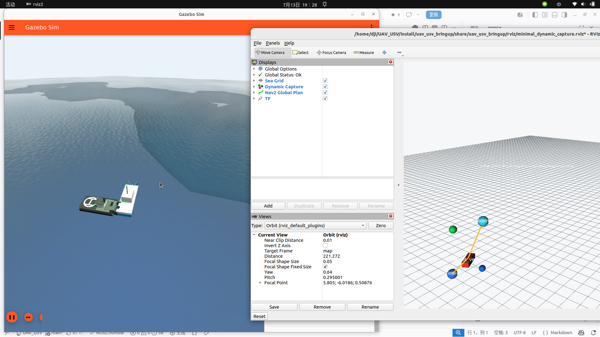

# 无人机-无人船动态围捕最小闭环验收记录

## 1. 验收范围

本轮只验证以下单机最小闭环，不包含多 PX4、Qt 重构和多载具任务分配：

```text
Gazebo target_vessel
  -> /fleet/perception/targets (TrackedObjectArray)
  -> capture_manager
  -> /fleet/control_lease (ControlLease)
  -> /fleet/command (FleetCommand)
  -> uav_dds_fleet_agent / usv_fleet_agent
  -> PX4 Offboard / Nav2 NavigateToPose
  -> 载具实际运动
  -> /fleet/state + /fleet/command_ack
```

任务层没有发布 Gazebo `cmd_vel` 或 PX4 `fmu/in/*`。低层控制只存在于 UAV/USV agent 和已有 Nav2-Gazebo 接口中。

## 2. 提交记录

| 阶段 | Git commit | 内容 |
|---|---|---|
| 基线审计 | `240a7d8` | 当前仓库架构、接口与历史实现审计 |
| 最小闭环实现 | `8d1b3a5` | 单目标、单 PX4 UAV、单 Nav2 USV 动态围捕 |

## 3. 修改文件

- `src/uav_usv_gazebo/worlds/minimal_dynamic_capture.sdf`：最小测试世界和三个 Gazebo entity。
- `src/uav_usv_mission/scripts/target_tracker.py`：把 `target_vessel` 的 Gazebo Pose_V 转为 `TrackedObjectArray` 并估计速度。
- `src/uav_usv_mission/scripts/capture_manager.py`：获取租约、完成起飞状态机、预测目标并生成空中观察点和水面截获点。
- `src/uav_usv_mission/scripts/capture_visualizer.py`：发布目标、载具、任务点和连线 Marker。
- `src/uav_usv_uav_control/scripts/uav_dds_fleet_agent.py`：FleetCommand 到 PX4 uXRCE-DDS Offboard 的单机 agent。
- `src/uav_usv_usv_control/scripts/usv_fleet_agent.py`：FleetCommand 到 Nav2 `NavigateToPose` action 的 USV agent。
- `src/uav_usv_bringup/launch/minimal_dynamic_capture.launch.py`：统一启动 Gazebo、DDS、PX4、Nav2、agent、任务节点和 RViz。
- `src/uav_usv_bringup/config/px4_minimal_capture.rcS`：PX4 SITL 启动与 DDS-only 仿真所需参数。
- `src/uav_usv_bringup/rviz/minimal_dynamic_capture.rviz`：最小闭环可视化配置。
- 各包的 `CMakeLists.txt` / `package.xml`：安装入口和运行依赖。

## 4. 构建与启动

```bash
cd ~/UAV_USV
source /opt/ros/humble/setup.bash
source ~/Desktop/Px4_ros/install/setup.bash

colcon build --symlink-install --packages-select \
  uav_usv_interfaces uav_usv_gazebo uav_usv_mission \
  uav_usv_uav_control uav_usv_usv_control uav_usv_bringup

source install/setup.bash
ros2 launch uav_usv_bringup minimal_dynamic_capture.launch.py
```

可通过参数覆盖外部工作区：

```bash
ros2 launch uav_usv_bringup minimal_dynamic_capture.launch.py \
  px4_dir:=<你的PX4-Autopilot路径> \
  px4_ros_ws:=<包含px4_msgs的ROS2工作区路径>
```

## 5. 静态测试

```bash
python3 -m py_compile \
  src/uav_usv_usv_control/scripts/usv_fleet_agent.py \
  src/uav_usv_uav_control/scripts/uav_dds_fleet_agent.py \
  src/uav_usv_mission/scripts/target_tracker.py \
  src/uav_usv_mission/scripts/capture_manager.py \
  src/uav_usv_mission/scripts/capture_visualizer.py \
  src/uav_usv_bringup/launch/minimal_dynamic_capture.launch.py

xmllint --noout \
  src/uav_usv_gazebo/worlds/minimal_dynamic_capture.sdf \
  src/uav_usv_bringup/package.xml \
  src/uav_usv_mission/package.xml

git diff --check
```

结果：Python 编译、XML 校验、空白符检查全部通过；六个相关 ROS 2 包构建通过。另在 `/var/tmp` 创建只包含提交 `8d1b3a5` 的 detached worktree 重新构建，六个包均通过，确认结果不依赖当前工作区中的其他未提交文件。

## 6. ROS 2 链路验证

```bash
ros2 topic echo /fleet/perception/targets --once
ros2 topic echo /fleet/state --once
ros2 topic echo /fleet/command_ack --once
ros2 topic echo /capture/status --once
ros2 topic info /fleet/command -v
ros2 topic info /uav_01/fmu/out/vehicle_status_v4 -v
```

实测结果：

- `/capture/status` 为 `CAPTURE_ACTIVE`。
- `target_vessel` 实测位置约 `(93.02, 10.15, 0.49)`，估计速度约 `(1.08, 0.79) m/s`。
- `uav_01` 从 `(-30, -24, 1.35)` 起飞并运动到约 `(100.01, 35.70, 21.99)`；`armed=true`，模式在动态导航完成时切换为 `PX4/HOLD`。
- `usv_01` 从 `(-12, 4, 0.35)` 运动到约 `(105.50, 26.02, 0.55)`；模式为 `NAV2`，实测速度约 `1.43 m/s`。
- `/fleet/command` 只有 `capture_manager` 一个发布者，订阅者只有 `uav_dds_fleet_agent` 和 `usv_01_agent`。
- PX4 `VehicleStatus` 的发布端显示为裸 DDS 实体，订阅端为 `uav_dds_fleet_agent`，证明 uXRCE-DDS 链路建立。
- USV Nav2 反馈由约 `78.2 m remaining` 持续下降；动态任务更新后保持在目标预测点附近跟随。

## 7. PX4 日志

本轮 ULog：

```text
/var/tmp/UAV_USV_minimal_capture/px4_instance_0/log/2026-07-13/11_25_58.ulg
```

文件大小约 47.9 MB。启动日志中的关键顺序：

```text
Ready for takeoff!
uxrce_dds_client synchronized
takeoff accepted; prestreaming Offboard setpoints
Armed by external command
PX4 armed and entered OFFBOARD; climbing
Takeoff detected
PX4 takeoff completed
world target converted to PX4 local NED setpoint
PX4 navigation target reached
```

ROS launch 日志：

```text
/home/dji/.ros/log/2026-07-13-19-25-51-535800-dji-Legion-R7000-AHP9-32579/launch.log
```

## 8. 运行截图



左侧 Gazebo 显示动态目标船和实际运动的载具；右侧 RViz 显示红色目标、蓝色 USV 截获点、青色 UAV 观察点、载具状态点、任务连线及 Nav2 路径。截图不是静态摆放结果，位置来自运行中的 `TrackedObjectArray`、`VehicleState` 与任务点 topic。

## 9. 当前问题

1. `target_tracker` 当前使用 Gazebo ground-truth Pose_V，尚未替换为真实相机或雷达检测结果。
2. 本机 `ros_gz_bridge` 与 Gazebo Harmonic 消息版本不匹配，因此任务节点使用 ROS wall time；Gazebo Transport 和 PX4 lockstep 各自正常工作。
3. 开阔海域测试关闭了激光避障，Nav2 使用空白 `400 m x 400 m` 地图；本轮只验收动态任务闭环。
4. 动态截获点每 5 秒更新，Nav2 会正常 preempt 旧 action。USV 稳定跟随，但通常与预测点保持约 8-15 m 的动态误差。
5. `PX4-Autopilot`、同步版本的 `px4_msgs` 工作区及 `/usr/local/bin/MicroXRCEAgent` 仍是外部运行前置条件。
6. Ctrl-C 时 Micro XRCE Agent 显示退出码 `-2`，这是 SIGINT 结束产生的日志，不是运行期 DDS 故障。
