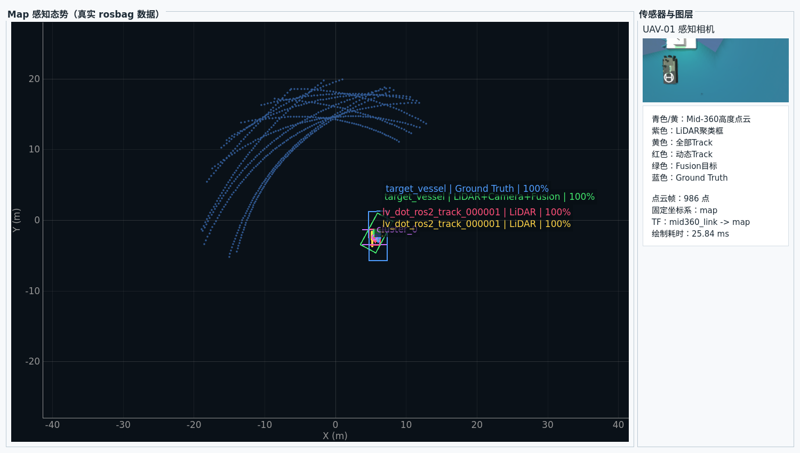

# Qt感知层俯视可视化报告

## 1. 目标与边界

本阶段只增强Qt显示层。未修改`capture_manager`、`FleetCommand`、PX4、Nav2、
UAV/USV agent、`perception_source_mux`及`/fleet/perception/targets`。

实现结果包括：

- Qt内部的`map`固定坐标系二维俯视画布；
- 可选的PyQtGraph OpenGL三维斜俯视画布；
- Mid-360轻量点云、LiDAR聚类框、Track、动态Track、Fusion和Ground Truth图层；
- UAV/USV位置、轨迹、速度箭头、标签与角色；
- UAV-01真实相机画中画；
- 图层开关、平移、缩放、自动跟随、显示范围及轨迹长度控制；
- 点云投影状态、画布刷新率、绘制耗时和覆盖帧统计。

当前没有嵌入RViz。现有Qt组件已经覆盖参考视频中的点云、动态目标、载具位姿和
相机画中画。只有需要完整RViz插件生态或复杂三维Marker类型时，才建议再评估RViz嵌入。

## 2. 组件结构

```text
PointCloud2 (sensor frame, high rate)
  |
  v
qt_pointcloud_projection_node
  - exact timestamp TF: map <- sensor_frame
  - map Z裁剪
  - XY voxel降采样
  - 最大点数和输出频率限制
  |
  +--> PoseArray (map, lightweight)
  +--> JSON status

MarkerArray / TrackedObjectArray / VehicleState / Camera Image
  |
  v
ROS MultiThreadedExecutor callbacks
  |
  v
TopDownVisualizationModel (Lock + latest-frame cache)
  |
  v
Qt QTimer (40 ms)
  |
  +--> PyQtGraph 2D map view
  +--> PyQtGraph OpenGL oblique 3D view
  +--> UAV-01 camera inset
```

主要文件：

| 文件 | 职责 |
| --- | --- |
| `uav_usv_perception/scripts/visualization/qt_pointcloud_projection_node.py` | 高频点云转轻量`PoseArray`，负责TF、裁剪、降采样和状态统计 |
| `uav_usv_mission/uav_usv_mission/perception_topdown.py` | 线程安全数据模型、二维/三维绘图、图层和交互 |
| `uav_usv_mission/scripts/fleet_base_station_gui.py` | ROS订阅、感知页布局、相机画中画、控制和状态面板 |
| `uav_usv_bringup/launch/dynamic_capture_console.launch.py` | 可选启动投影节点和Qt感知页面 |

## 3. Topic与坐标

| 数据 | Topic | 类型 | 画布用途 |
| --- | --- | --- | --- |
| 过滤点云输入 | `/perception/usv_01/mid360/points_filtered` | `sensor_msgs/PointCloud2` | 投影节点输入，主世界默认值 |
| 轻量点集 | `/perception/visualization/usv_01/topdown_points` | `geometry_msgs/PoseArray` | Qt点云图层 |
| 投影状态 | `/perception/visualization/usv_01/topdown_status` | `std_msgs/String` JSON | 频率、点数、延迟、TF失败和丢帧统计 |
| 聚类框 | `/perception/lv_dot_ros2/diagnostics/lidar_bboxes` | `visualization_msgs/MarkerArray` | 紫色框 |
| 全部Track | `/perception/lv_dot_ros2/tracks` | `TrackedObjectArray` | 黄色目标 |
| 动态Track | `/perception/lv_dot_ros2/dynamic_tracks` | `TrackedObjectArray` | 红色目标 |
| 融合目标 | `/perception/fused/tracks` | `TrackedObjectArray` | 绿色目标 |
| 真值 | `/perception/ground_truth/tracks` | `TrackedObjectArray` | 蓝色对照 |
| 舰队状态 | `/fleet/state` | `VehicleState` | UAV/USV位置、航向和速度 |
| UAV相机 | `/fleet/uplink/uav_01/camera/image_raw` | `sensor_msgs/Image` | 右侧画中画 |

点云投影必须使用点云`header.stamp`查询`map <- sensor_frame`。查询失败时丢弃该帧，
不使用“最新TF”代替，也不通过修改点坐标掩盖TF问题。输出的`PoseArray.header.frame_id`
固定为`map`。

## 4. 绘图与交互

二维模式采用正交XY投影，默认X向右、Y向上。鼠标滚轮缩放、拖动平移，双击恢复默认
视野。三维模式采用OpenGL斜俯视，可旋转、平移和缩放。两种模式共享同一份缓存，不增加
ROS订阅。

默认样式：

- 点云：青色；可切换为按Z高度着色；
- 聚类框：紫色；
- Track：黄色；
- 动态Track：红色；
- Fusion：绿色；
- Ground Truth：蓝色；
- UAV：蓝色三角；
- USV：黄色方形。

同一目标来自多个来源时，标签按图层错开，避免完全重叠。点击二维目标或聚类中心可查看
ID、来源、类别、位置、速度、尺寸、置信度、数据年龄和动态/融合状态。

## 5. 线程与性能策略

- ROS 2使用已有`MultiThreadedExecutor`线程；
- ROS回调只更新`TopDownVisualizationModel`，不操作Qt控件；
- 模型使用互斥锁，点云采用最新帧覆盖，不排队；
- Qt用40 ms定时器读取快照；没有新数据时不重复绘制；
- 点云只在点云帧或显示参数变化时上传，Track更新不会重复上传整帧点云；
- 点云关闭后Qt不绘制点集；
- 数据超过3秒未更新后从画布隐藏；
- OpenGL按需加载；离屏或无OpenGL环境自动保留二维模式。

## 6. 点云降采样

投影节点处理顺序：

1. 删除NaN/Inf；
2. 按消息时间戳转换到`map`；
3. 在`map`中按`min_z/max_z`裁剪；
4. 使用XY voxel保留每个栅格一个点；
5. 使用确定性等间隔索引限制最大点数；
6. 以限制频率发布最新结果。

该节点不改变Mid-360原始和预处理Topic，Qt也不直接解析高频完整`PointCloud2`。

## 7. 启动参数

```bash
ros2 launch uav_usv_bringup dynamic_capture_console.launch.py
```

| 参数 | 默认值 | 说明 |
| --- | --- | --- |
| `enable_perception_topdown` | `true` | 启用Qt感知画布和订阅 |
| `enable_pointcloud_projection` | `true` | 启动轻量点云投影节点 |
| `topdown_points_input_topic` | `/perception/usv_01/mid360/points_filtered` | 主世界过滤点云 |
| `topdown_camera_topic` | `/fleet/uplink/uav_01/camera/image_raw` | 感知相机画中画 |
| `topdown_point_rate` | `5.0` | 投影输出频率Hz |
| `topdown_max_points` | `10000` | 单帧最大绘制点数 |
| `topdown_voxel_size` | `0.20` | XY体素尺寸m |
| `topdown_min_z` | `-1.0` | map坐标最低高度m |
| `topdown_max_z` | `8.0` | map坐标最高高度m |
| `use_sim_time` | `false` | rosbag回放时设为`true` |

旧接口使用`/perception/usv_01/points_filtered`时可覆盖参数：

```bash
ros2 launch uav_usv_bringup dynamic_capture_console.launch.py \
  topdown_points_input_topic:=/perception/usv_01/points_filtered
```

依赖安装：

```bash
sudo apt install python3-pyqtgraph python3-opengl python3-pyqt5
```

## 8. 实测结果

### 8.1 真实数据帧

使用`bags/lv_dot_acceptance/constant_final_20260715`，并复用Phase 4/多源融合已验收输出：

- 点云：986点；
- 原生ROS2 Track：3；
- 动态Track：1；
- Fusion：1；
- Ground Truth：1；
- 相机：UAV-01真实Gazebo图像；
- TF：`map -> usv_01/odom -> usv_01/base_link -> usv_01/mid360_link`；
- 所有绘图数据最终位于`map`。

截图：



### 8.2 高负载组件测试

离屏二维模式，10,000点以5 Hz更新，动态Track以10 Hz更新，持续30秒：

| 指标 | 结果 |
| --- | ---: |
| 有效画布更新率 | 10.00 Hz |
| 最后一次绘制耗时 | 2.13 ms |
| 进程CPU | 14.7% |
| RSS起始/结束 | 76.3 / 92.7 MiB |
| RSS峰值 | 92.7 MiB |
| 点云覆盖帧 | 0 |

RSS增长主要发生在首次分配10,000个Qt点和轨迹对象时。本次未在受限沙箱中完成30分钟
完整舰队桌面运行，因此不把30秒组件测试写成30分钟验收。

### 8.3 自动测试

- 投影数学、Z裁剪、体素、最大点数和四元数旋转：2项通过；
- Marker俯视矩形、点云缓存、Track历史：2项通过；
- 相关包已有测试汇总：55项，0失败；
- `ament_flake8`和`git diff --check`通过。

## 9. 已知问题与结论

1. 当前执行沙箱禁止DDS socket和桌面X连接，因此最终版本未在此环境完成在线ROS图及
   OpenGL桌面截图；真实rosbag内容通过直接反序列化完成坐标和图层验证。
2. 三维模式依赖有效OpenGL上下文；不可用时界面禁用该选项并继续使用二维模式。
3. `MarkerArray`当前正式支持`LINE_LIST`、`LINE_STRIP`和`CUBE`俯视显示；其他Marker
   类型会忽略，不影响感知算法。
4. 默认固定青色点云性能最好；高度着色适合点数较少或三维展示时手动开启。
5. 当前阶段无需嵌入RViz。正常桌面复验若发现OpenGL兼容问题，可先保持二维主模式，
   再把RViz嵌入作为独立后备方案，不改变数据缓存和投影节点。

本报告随本阶段独立Git提交交付。
