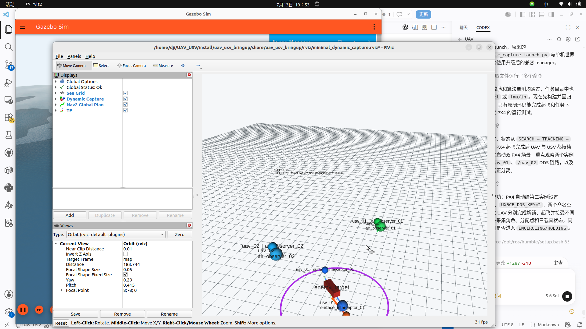

# 可扩展动态围捕框架验收报告

日期：2026-07-13

## 1. 本阶段目标

在不破坏单 UAV + 单 USV 最小闭环的前提下，将任务层扩展为：

- `uav_01`：PX4 空中观察角色 1
- `uav_02`：PX4 空中观察角色 2
- `usv_01`：Nav2 水面截获角色
- `enemy_target`：Gazebo 动态目标船

所有任务控制继续通过 `FleetCommand -> agent` 下发。任务节点不发布 Gazebo
`cmd_vel`，也不发布 PX4 `/fmu/in/*` 底层话题。

## 2. 架构变化

```text
Gazebo enemy_target
        |
        v
target_tracker ----> /fleet/perception/targets (TrackedObjectArray)
                              |
                              v
                       capture_manager
                     状态机、租约、任务调度
                         |           |
                         |           +--> target_predictor
                         |                匀速轨迹预测
                         |
                         +--------------> capture_planner
                                          多载具围捕点分配
                              |
                              v
                     /fleet/command (FleetCommand)
                       /        |         \
                      v         v          v
             uav_01 agent  uav_02 agent  usv_01 agent
                  |            |             |
                  v            v             v
             PX4 instance 0 PX4 instance 1  Nav2
                  |            |             |
                  +------------+-------------+
                               |
                 /fleet/state + /fleet/command_ack
                               |
                               v
                     capture_manager / visualizer
```

`capture_visualizer` 只订阅状态与规划结果并发布 Marker，不参与任务决策。

## 3. 任务层模块

### target_predictor

文件：`src/uav_usv_mission/uav_usv_mission/target_predictor.py`

- 输入目标位置、速度和时间戳。
- 使用常速度模型生成未来轨迹。
- 默认预测 12 秒，采样间隔 1 秒。
- 提供按指定未来时刻插值取点的接口。

### capture_planner

文件：`src/uav_usv_mission/uav_usv_mission/capture_planner.py`

- 输入预测轨迹、UAV ID 列表和 USV ID 列表。
- UAV 均匀分配在预测中心周围的围捕圆上。
- 两架 UAV 位于相对扇区，水平目标点相距 36 米，不会争抢同一点。
- UAV 使用错开的观察高度，本场景为 22 米和 24 米。
- USV 始终使用 `surface_interceptor` 角色，目标点位于更远期预测位置。

### capture_manager

文件：`src/uav_usv_mission/scripts/capture_manager.py`

- 维护任务状态机、控制租约、载具就绪状态和命令重发。
- 兼容原来的 `uav_id`、`usv_id` 单载具参数。
- 新增 `uav_ids`、`usv_ids` 列表参数。
- 只发布标准 `FleetCommand`，接收 `VehicleState` 和 `CommandAck`。
- 动态目标移动超过阈值或命令周期到期时更新任务。

状态机：

```text
SEARCH -> TRACKING -> APPROACHING -> ENCIRCLING
                                      |
                                      v
                                  HOLDING -> SUCCESS

任一阶段发生目标超时、起飞失败或不可恢复错误时可进入 FAILED。
```

### capture_visualizer

文件：`src/uav_usv_mission/scripts/capture_visualizer.py`

发布 `/capture/markers`，显示：

- 目标当前位置和速度；
- 目标预测轨迹；
- 围捕半径；
- 每个载具的分配点；
- 载具到分配点的连线；
- 载具角色标签和任务状态。

## 4. ROS 2 接口

| Topic | 类型 | 发布者 | 订阅者 |
|---|---|---|---|
| `/fleet/perception/targets` | `TrackedObjectArray` | `target_tracker` | `capture_manager`, `capture_visualizer` |
| `/fleet/command` | `FleetCommand` | `capture_manager` | 两个 UAV agent、USV agent |
| `/fleet/state` | `VehicleState` | 三个 agent | `capture_manager`, `capture_visualizer` |
| `/fleet/command_ack` | `CommandAck` | 三个 agent | `capture_manager` |
| `/fleet/control_lease` | `ControlLease` | `capture_manager` | 三个 agent |
| `/capture/target_prediction` | `nav_msgs/Path` | `capture_manager` | `capture_visualizer` |
| `/capture/assignment_points` | `geometry_msgs/PoseArray` | `capture_manager` | `capture_visualizer` |
| `/capture/roles` | JSON `std_msgs/String` | `capture_manager` | `capture_visualizer`, Qt 可选 |
| `/capture/state` | `std_msgs/String` | `capture_manager` | `capture_visualizer`, Qt 可选 |
| `/capture/target_status` | JSON `std_msgs/String` | `capture_manager` | `capture_visualizer`, Qt 可选 |
| `/capture/markers` | `visualization_msgs/MarkerArray` | `capture_visualizer` | RViz |

PX4 DDS namespace：

- `uav_01`：`/uav_01/fmu/*`，PX4 instance 0，`MAV_SYS_ID=1`，DDS key 1。
- `uav_02`：`/uav_02/fmu/*`，PX4 instance 1，`MAV_SYS_ID=2`，DDS key 2。

Gazebo entity：`uav_01`、`uav_02`、`usv_01`、`enemy_target`。
统一可视化和任务坐标系为 `map`。

## 5. 启动与验证

构建：

```bash
cd <你的工作区路径>/UAV_USV
source /opt/ros/humble/setup.bash
colcon build --symlink-install --packages-select \
  uav_usv_interfaces uav_usv_mission uav_usv_usv_control \
  uav_usv_gazebo uav_usv_bringup
source install/setup.bash
```

启动双 UAV 动态围捕：

```bash
source <你的px4_msgs工作区>/install/setup.bash
ros2 launch uav_usv_bringup dual_uav_dynamic_capture.launch.py
```

验证命令：

```bash
ros2 topic echo --once /capture/state
ros2 topic echo --once --full-length /capture/roles
ros2 topic echo --once /capture/assignment_points
ros2 topic echo /fleet/state --field vehicle_id
ros2 topic info --verbose /fleet/command
ros2 topic info /uav_01/fmu/in/vehicle_command
ros2 topic info /uav_02/fmu/in/vehicle_command
ros2 topic hz /capture/markers
```

算法测试：

```bash
colcon test --packages-select uav_usv_mission --event-handlers console_direct+
colcon test-result --verbose
```

结果：2 个围捕算法测试通过；工作区汇总为 3 tests、0 errors、0 failures。

## 6. 运行结果

2026-07-13 双机实测结果：

- 两个 PX4 实例均完成 Gazebo 绑定和 DDS 同步。
- `uav_01`、`uav_02` 均成功解锁、进入 OFFBOARD 并完成起飞。
- 状态机完整经过 `SEARCH -> TRACKING -> APPROACHING -> ENCIRCLING -> HOLDING -> SUCCESS`。
- 最终角色为 `air_observer_01`、`air_observer_02`、`surface_interceptor_01`。
- 一次实测 UAV 分配点为 `(102.21, 37.63, 22)` 和
  `(136.49, 26.63, 24)`，水平间距约 36 米。
- 同次 USV 截获点为 `(121.25, 38.03, 0.55)`。
- `/fleet/command` 实测为 1 个发布者、3 个订阅者。
- 两个 `/fmu/in/vehicle_command` 均为 1 个 agent 发布者、1 个 PX4 订阅者。
- `/capture/markers` 发布频率稳定为 5.0 Hz。
- USV 多轮动态更新使用 Nav2 原生目标抢占，没有任务级 `canceled/FAILED` 回执。

运行截图：



ROS 2 日志：

```text
/home/dji/.ros/log/2026-07-13-20-00-14-222321-dji-Legion-R7000-AHP9-41894
```

PX4 ULog：

```text
/var/tmp/UAV_USV_dual_capture/px4_instance_0/log/2026-07-13/12_00_21.ulg
/var/tmp/UAV_USV_dual_capture/px4_instance_1/log/2026-07-13/12_00_21.ulg
```

## 7. 兼容性与已知问题

- 原 `minimal_dynamic_capture.launch.py` 已回归通过，单 UAV 闭环未被移除。
- Qt 本阶段没有重构，只可按需订阅新增状态话题。
- 当前预测器是匀速模型，目标急转时预测点会有短暂偏差。
- 当前任务成功代表持续满足几何围捕条件，不代表目标已物理停止。
- Gazebo 会输出旧 PX4 模型中 `gz_frame_id` 的 SDF 兼容性警告，不影响本次控制闭环。
- 启动早期 Nav2 等待 `odom` TF 的短暂提示会在船体接口发布 TF 后恢复。
